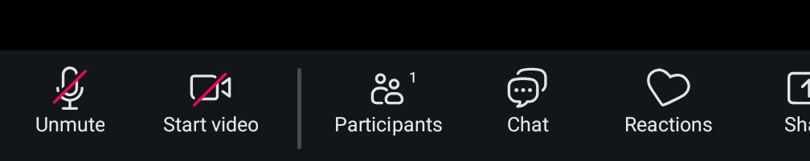
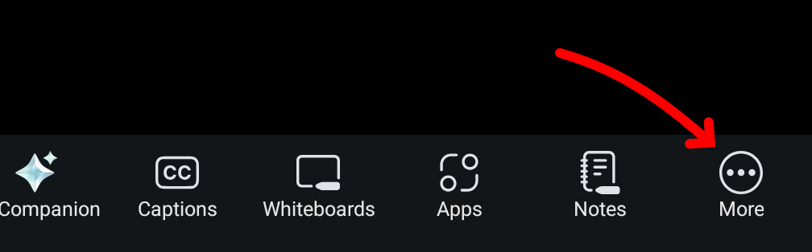
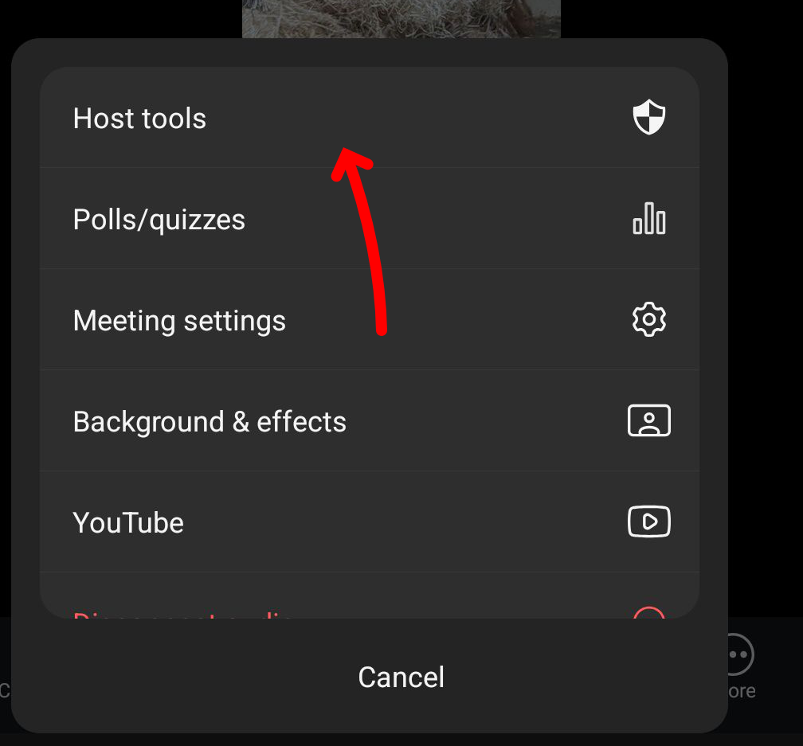
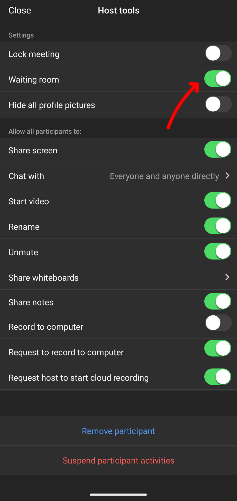
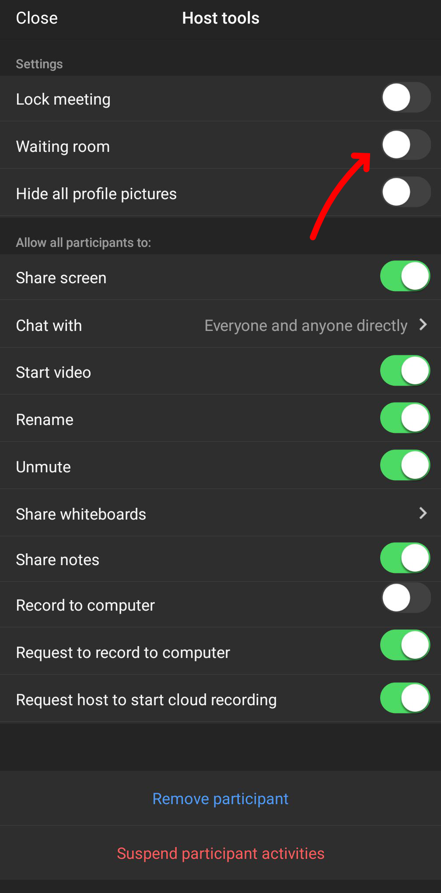
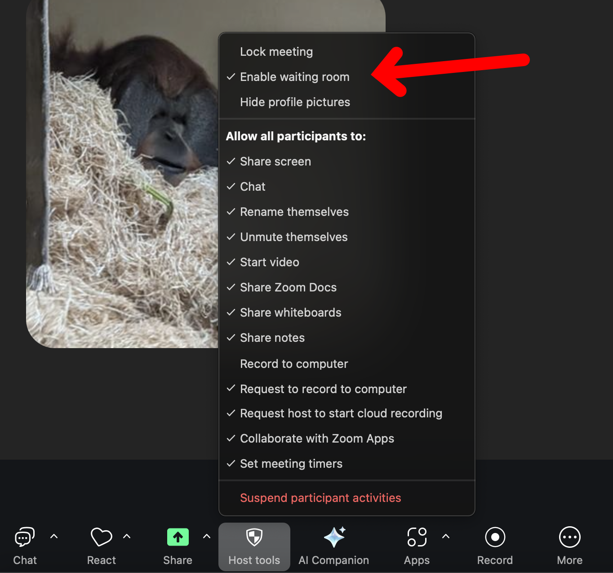
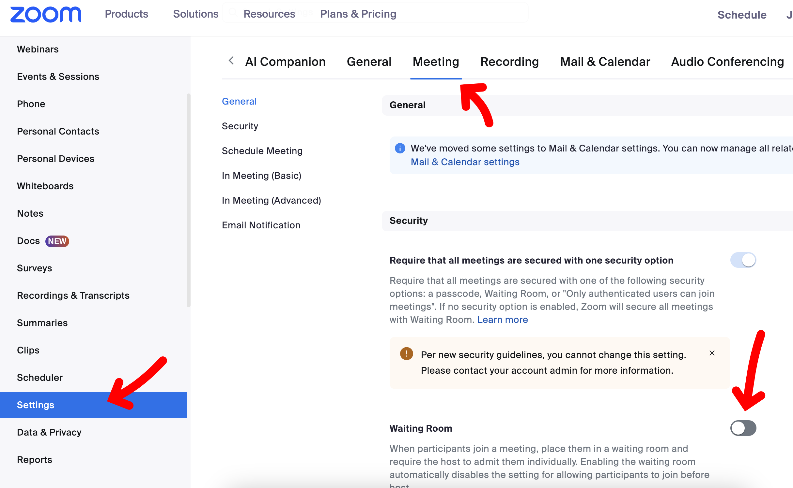

# ปิดแบบชั่วคราว

การปิดแบบชั่วคราว คือ ปิดเป็นครั้ง ๆ ไป ถ้าเราไม่ได้ปิดแบบถาวร แล้วมีการสร้าง meeting ใหม่ ก็จะมี waiting room อีก ถ้าไม่อยากให้มี waiting room ตลอดไป ต้องไป [ปิดแบบถาวร](#ปิดแบบถาวร)

## ปิดจาก Zoom Mobile

เริ่มจากจิ้มที่หน้าจอบนมือถือ เพื่อเปิดเมนู

แล้วเลื่อนไปที่เมนูด้านขวา จะเจอเมนู More แล้วจิ้มเพื่อเปิด popup menu

ใน popup menu เลือก Host tools

หน้าจอ Host tools จะเห็นไอเท็มนึงเขียนว่า Waiting room

ก็กดปิด เป็นอันจบ

## ปิดจาก Zoom Desktop

วิธีปิดใน Zoom Desktop ทำได้โดยการกดเมนู Host tools แล้วกดที่ Enable waiting room เพื่อเอาเครื่องหมายถูกออก

# ปิดแบบถาวร

การปิดแบบถาวรคือจะปิด waiting room ตลอดไป ถ้าอยากจะเปิดใหม่ก็ให้กลับมาทำแบบนี้อีกทีนึง เพื่อทำการเปิด waiting room

วิธีปิด เริ่มจาก Login เข้า [Zoom account](https://zoom.us) บนเว็บ เสร็จแล้ว ก็ไปที่ Settings เลือก Meeting และเลื่อนไปหัวข้อ Waiting Room แล้วกดปิด

